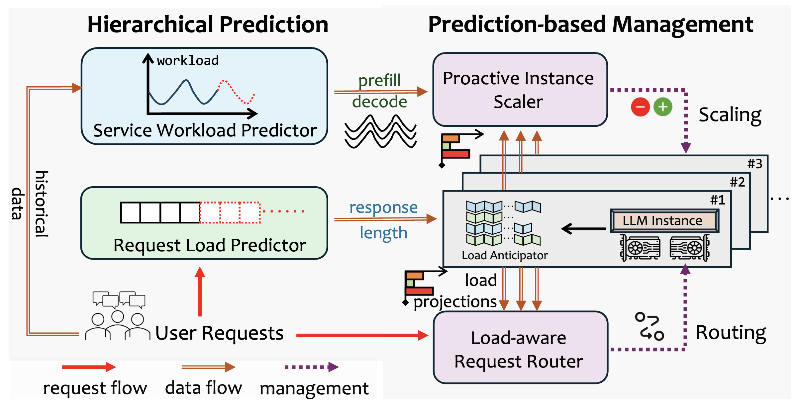

# PRISM: Proactive Workload-Aware Optimization for Hybrid-Service in LMaaS Systems

[](https://github.com/stephen-tju/PRISM/actions/workflows/tests.yml)

Code for our IEEE ICDCS 2026 paper:

**Prism: Proactive Workload-Aware Optimization for Hybrid-Service in LMaaS Systems**

PRISM is a research prototype for managing Large-Model-as-a-Service (LMaaS)
systems under heterogeneous hybrid-service workloads. It combines online
response-length estimation, heterogeneity-aware request routing, and
peak-pressure adaptive scaling on top of a vLLM-compatible serving foundation.



## Overview

Modern LMaaS platforms serve a mixture of latency-critical interactive requests
and latency-tolerant batch requests. Their prompt lengths, response lengths,
arrival patterns, and latency objectives vary substantially, making resource
provisioning and request scheduling difficult.

PRISM addresses these challenges through:

- **Response-length perception**: an online prompt-conditioned estimator that
  predicts output lengths from recent completed requests.
- **Heterogeneity-aware routing**: an inter-instance router that accounts for
  prompt prefill cost, decode cost, workload similarity, and congestion.
- **Peak-pressure adaptive scaling**: a lightweight anticipator that projects
  memory pressure from runtime serving counters and adjusts active instances.
- **Reproducible artifact support**: deterministic unit tests, a synthetic dry
  run, analysis scripts, and experiment reproduction notes.

## Repository Layout

```text
LLMServe/
  prism/                    # PRISM control logic
    config.py               # Runtime and experiment configuration
    response_perceptron.py  # Online response-length estimator
    routing.py              # Heterogeneity-aware inter-instance routing
    scaling.py              # Peak-workload anticipation and adaptive scaling
    scheduler.py            # PRISM request coordinator
    tests/                  # Deterministic PRISM unit tests
  global_scheduler/         # Baseline scheduling and scaling components
  request_generater/        # Workload and request generation
  serve_instance/           # vLLM instance interface and lookahead state
  benchmark.py              # Baseline benchmark entrypoint
prism_benchmark.py          # PRISM benchmark entrypoint
prism_config.json           # Default PRISM configuration
instance_configurations_4.json
instance_configurations_8.json
offline_train.py            # Request load predictor training
data/                       # Dataset and workload preprocessing scripts
experiments/                # Reproducibility notes and plotting scripts
results/                    # Analysis utilities and smoke-test artifacts
scripts/                    # vLLM launch and benchmark scripts
```

## Installation

```bash
conda create -n prism python=3.10 -y
conda activate prism
pip install -r requirements.txt
pip install -e .
```

For live serving experiments, install a CUDA-compatible PyTorch stack and ensure
that `vllm==0.6.6.post1` is available in the environment.

## Quick Check

The following commands run without launching vLLM servers:

```bash
python -m unittest discover LLMServe/prism/tests
python prism_benchmark.py --dry_run
```

The dry run exercises PRISM response prediction, routing, result recording, and
configuration handling with deterministic synthetic requests.

## Running PRISM

```bash
python prism_benchmark.py \
  --request_num 2000 \
  --model_name "meta-llama/Llama-2-7b-hf" \
  --load ShareGPT \
  --load_dataset_path "../data/datasets/ShareGPT/cleaned.csv" \
  --workload poisson \
  --qps 2 \
  --num_instances 1 \
  --instance_configurations instance_configurations_4.json \
  --enable_prism_scaler
```

PRISM parameters are configured in `prism_config.json`.

## Reproducing Experiments

See [experiments/Reproducibility.md](experiments/Reproducibility.md) for dataset
preprocessing, benchmark execution, and plotting instructions for the paper's
motivation study and evaluation questions.

The data scripts download public datasets and traces, including ShareGPT and
public Azure LLM inference traces. Commercial platform traces used in the paper
are not redistributed in this artifact.

Large trained predictor checkpoints are not stored in Git. Use
`offline_train.py` to regenerate the request load predictor when running full
serving experiments.

## Baseline Compatibility

The original baseline benchmark remains available:

```bash
cd LLMServe
python benchmark.py \
  --request_num 2000 \
  --model_name "meta-llama/Llama-2-7b-hf" \
  --result_dir "../results/cases/" \
  --load ShareGPT \
  --load_dataset_path "../data/datasets/ShareGPT/cleaned.csv" \
  --workload poisson \
  --qps 2 \
  --num_instances 1 \
  --scheduler_policy preserve \
  --scaler_policy none \
  --req_predictor_policy load_predictor \
  --max_model_len 4096 \
  --max_num_seqs 128 \
  --max_num_batched_tokens 8192
```

## Artifact Scope

This repository exposes the PRISM framework-layer implementation used for
research reproducibility. It includes the response-length perceptron,
inter-instance routing, adaptive scaling control, result analysis scripts, and
deterministic tests. Direct iteration-level preemption inside vLLM requires
scheduler hooks below the OpenAI-compatible HTTP interface and is documented in
the runtime configuration notes.

## Citation

If you use this repository, please cite:

```bibtex
@inproceedings{li2026prism,
  title = {Prism: Proactive Workload-Aware Optimization for Hybrid-Service in LMaaS Systems},
  author = {Li, Yuting and Qiu, Chao and Huang, Shaoyuan and Zhang, Tengwen and Zhao, Yunfeng and Wang, Xiaofei},
  booktitle = {Proceedings of the IEEE International Conference on Distributed Computing Systems (ICDCS)},
  year = {2026}
}
```

## License

This project is released under the MIT License. See [LICENSE](LICENSE).
